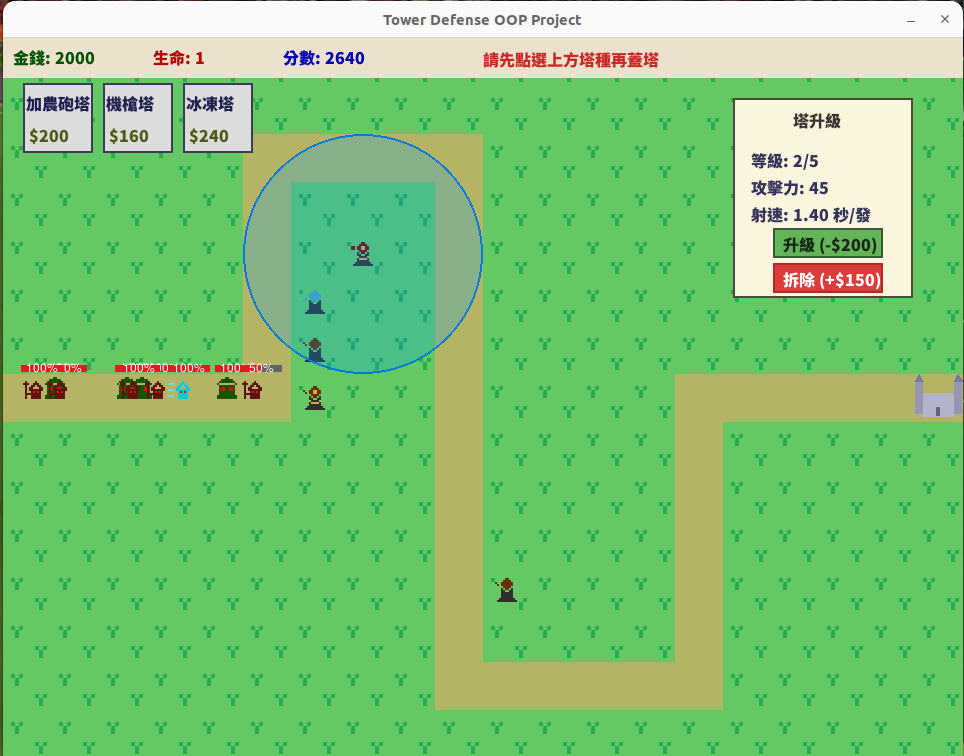
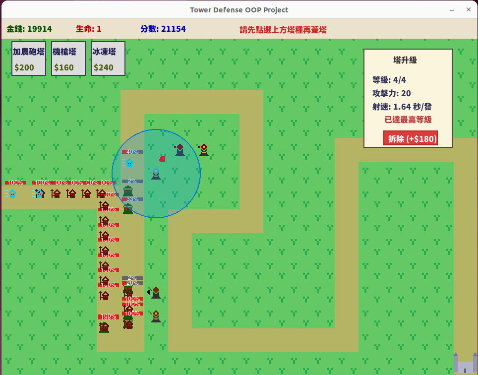

# Tower Defense OOP Project

這個專案是一款以 Python 物件導向程式設計（OOP）實作的塔防遊戲。遊戲中玩家可於地圖上建造多種防禦塔，阻擋並消滅持續來襲的敵人。專案包含金錢與升級系統、分數結算、豐富的 UI 介面與音效，支援多種敵人與投射物型態，並具備主選單、遊戲結束畫面等完整流程。

---

## 📁 專案目錄結構

```
group12_project/
├── README.md                # 專案說明文件
├── requirements.txt         # 依賴套件列表
├── main.py                  # 主程式入口
├── docs/                    # 文件資料夾
├── src/                     # 遊戲核心原始碼
│   ├── game/                # 遊戲流程與狀態管理
│   ├── entities/            # 遊戲單位（塔、敵人、投射物）
│   │   ├── towers/          # 各類防禦塔
│   │   ├── enemies/         # 各類敵人
│   │   └── projectiles/     # 投射物（砲彈、子彈、冰球等）
│   ├── ui/                  # 遊戲介面與操作模組
│   └── utils/               # 輔助工具與常數設定
├── assets/                  # 圖片、音效等資源
├── tests/                   # 單元測試
└── screenshots/             # 遊戲截圖與動畫
```

---

## 🎮 遊戲玩法與特色

- 以滑鼠操作放置/升級防禦塔，阻止敵人穿越地圖終點
- 多種塔類型與特色技能：
    - 加農砲塔：高傷害、範圍攻擊，射速較慢
    - 機槍塔：射速快、單體攻擊，傷害較低
    - 冰凍塔：輔助型，投擲冰球減速敵人
- 多種敵人類型（基本型、快速型、坦克型）具不同血量與速度
- 投射物支援多型態（砲彈、子彈、冰球）
- 金錢與升級系統：擊敗敵人賺取金錢、建造與升級塔
- 升級面板顯示塔資訊（等級、傷害、射速），並提示升級上限
- 多波敵人進攻，隨波數增加難度提升
- 即時分數計算與結算系統
- 豐富音效（建塔、攻擊、敵人死亡等）提升遊戲沉浸感
- 主選單與結束畫面，流程簡潔直覺
- 單元測試支援，利於功能驗證與開發

---

## 🆕 近期主要功能更新（v1.3, 2025-05）

- 新增「冰球」投射物（IceBall），命中可減速敵人
- UI 升級面板優化，點選塔即顯示升級選項與屬性資訊
- 完善塔的升級機制，支援升級上限提示與數值顯示
- 音效與資源整理分類，利於後續維護與擴充
- OOP 架構強化，塔與敵人模組化更清晰，方便擴展
- 新增主選單與結束畫面，整體流程更順暢

---

## 🧱 架構總覽（OOP 模組）

- 遊戲管理模組 (src/game/)
    - GameManager：主控遊戲流程與狀態
    - MapManager：地圖邏輯與塔位管理
    - WaveManager：敵人波數與出場時機管理
- 遊戲單位模組 (src/entities/)
    - BaseEntity：所有遊戲物件的基底類別
    - towers/：各類塔及其升級邏輯
    - enemies/：敵人種類與行為
    - projectiles/：投射物邏輯（砲彈、冰球等）
- UI 模組 (src/ui/)
    - GameUI：遊戲內資訊顯示與操作介面
    - Menu：主選單與結束畫面
- 輔助模組 (src/utils/)
    - constants.py：全域常數設定
    - helpers.py：常用輔助函式
    - animation.py：動畫處理模組

---

## 🚀 安裝與執行方式

1. 安裝依賴（建議使用 Python 3.9 以上）
    ```bash
    pip install -r requirements.txt
    ```
    若遇到 pygame 安裝問題，可嘗試：
    ```bash
    python -m pip install pygame --pre
    ```

2. 啟動遊戲
    ```bash
    python main.py
    ```

---

## 🧪 單元測試

執行全部測試：
```bash
python -m unittest discover tests
```

---

## 📸 遊戲截圖與動畫

- 
- 
- 
---
